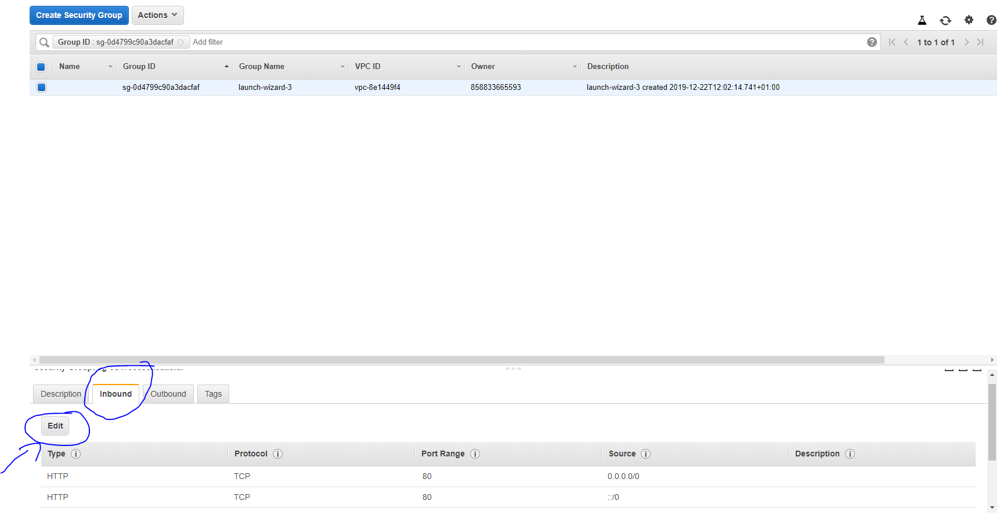
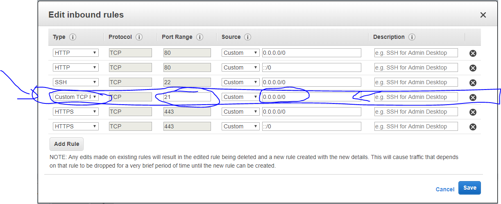
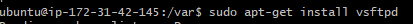
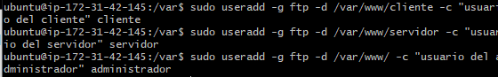
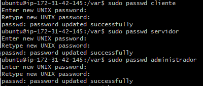
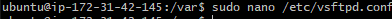
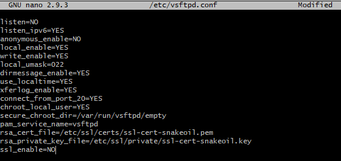
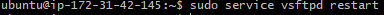
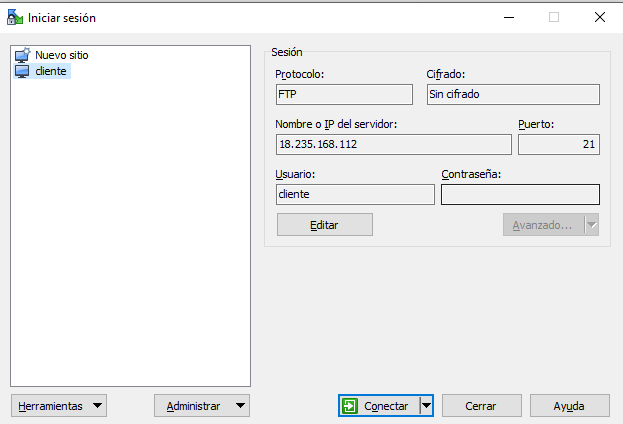

### Virtual host

Para empezar esta evidencia, iremos a *inbound* em *launch-wizard-3* y le vamos a meter otro puerto, en este caso el puerto 21.

Le daremos al botón de *edit* y posteriormente al de *add rules*.

Una vez hecho esto, abriremos nuestro cmd y ahí instalaremos en nuestra máquina virtual el programa vsftpd

Tras instalarlo, crearemos un usuario con su respectiva contraseña para cada subdominio utilizando el comando useradd y passwd

Ya creado los usuarios, iremos al archivo *vsftpd.conf* para borrar y editar unas cuantas líneas

Hasta que te quede así

Y después de todo esto, reiniciamos el ftpd

Por último dejamos el terminal para volver a nuestro ordenador para abrir la aplicación WINSCP para poder conectarlo con la máquina virtual.

Una vez iniciada la sesión, iremos al apartado de *avanzado* y le daremos en *conexión para desactivar el modo pasivo.

Finalmente, si le damos a conectar debería de salirnos nuestras carpetas 

