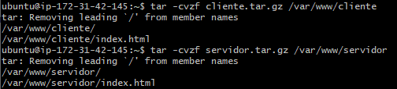
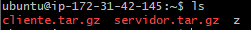
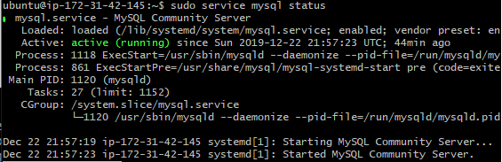
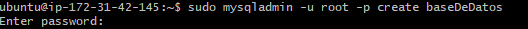

###  Crear copias de seguridad mediante comandos

En esta práctica aprenderemos a crear copias de seguridad creando archivos *tar* donde comprimiremos nuestras carpetas (En nuestro caso *cliente* y *servidor*)

Para eso utilizaremos el siguiente comando que aparece en pantalla:

Lo aremos 2 veces (1 por cada carpeta) y si queremos comprobar que el comando se ha ejecutado correctamente basta con utilizar el comando *ls* para ver los archivos que se encuentran en dicho directorio

Una vez comprimidos los archivos, haremos algo parecido con la base de datos exportando una base de datos ya existente o creando una y descargándola, pero antes de nada vamos a ver el estado del *mysql service* para ver si está activado.

Tras ver el estado del mysql service, me dispuse a crear una base de datos ya que no tenía ninguna creada. 

Podéis crear vosotros también en el caso de que no tengáis ninguna como en mi caso o si tenéis ya creada podéis utilizar esa base de datos.