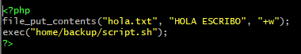
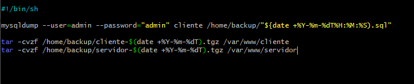
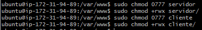
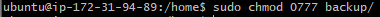
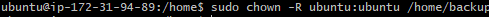

### Tarea 7: automatizar 

En esta evidencia, aprenderemos lo que hicimos en la evidencia 6 - copia de seguridad pero esta vez, lo vamos a automatizar para que cree una copia de seguridad cada semana.

Lo primero de todo será crear una carpeta llamada backup en la que guardaremos un archivo php.

 para ejecutar un sh.

 

 para poder hacer un tar de los archivos de dicha carpeta, usaremos el comando chmod en las dos carpetas.

 

Haremos lo mismo en la carpeta de los dos archivos que acabamos de crear.

 

Y finalmente un chown para poder ejecutar los archivos.

Para terminar, crearemos un archivo contab en el cual solo pondremos el siguiente comando `0 20 * * * php /var/www/servidor/script.php` para poder automatizar la acción.