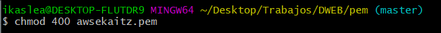
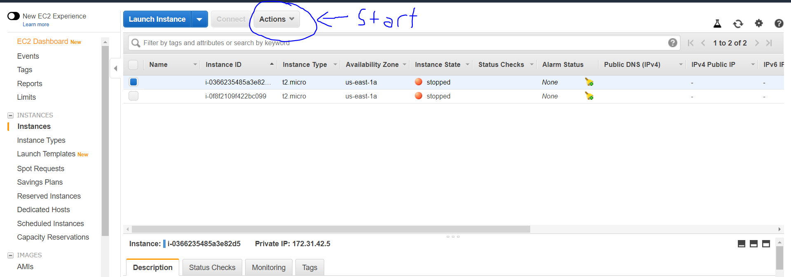
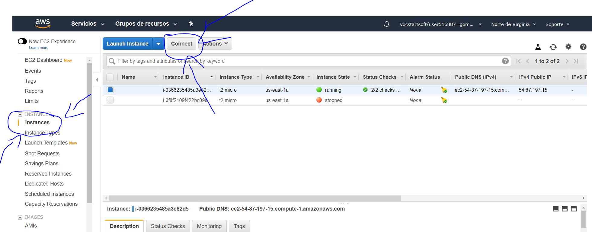
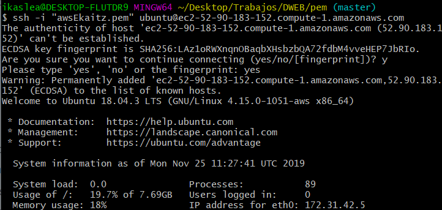
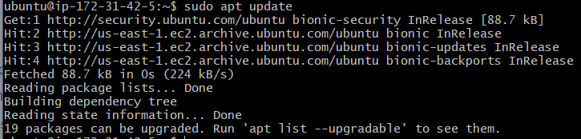
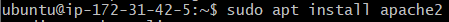
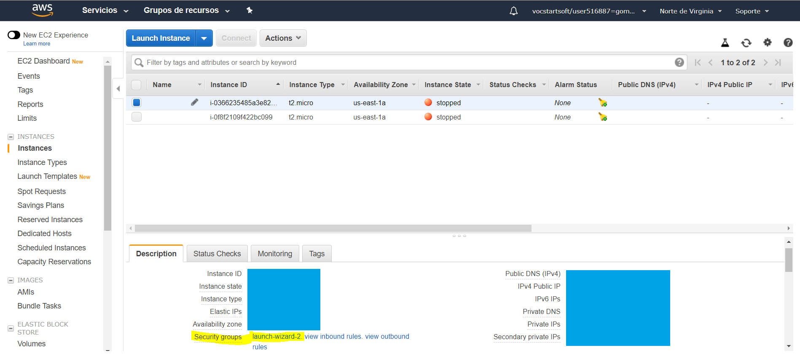
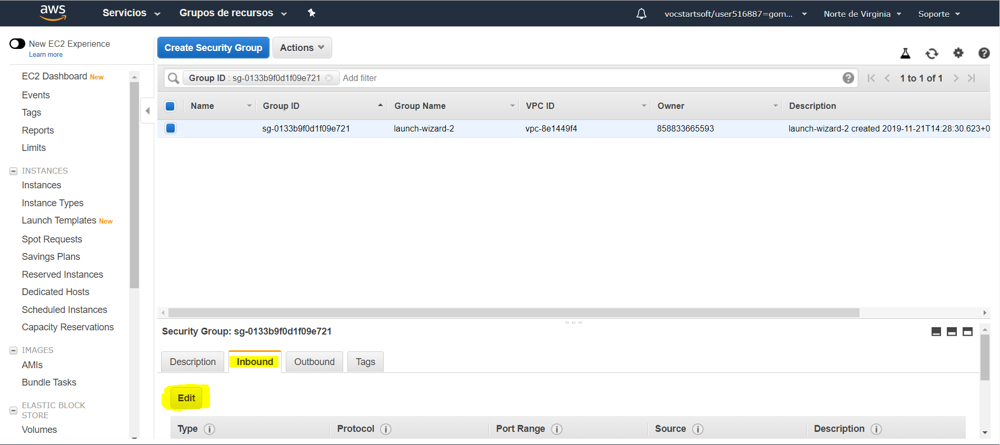
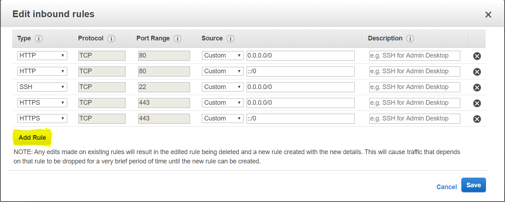

# Servidor remoto

Para poder subir nuestros trabajos a internet, es necesario tener una máquina virtual que haga como servidor remoto de nuestro trabajo.

Para eso, hemos hecho una cuenta en [AWS](https://aws.amazon.com/es/education/awseducate/) (Amazon web services), ya que esta página nos da la posibilidad de crear todas las máquinas virtuales que querammos gratuitamente. Lo malo de esta forma gratuita, es que los servidores no pueden estar encendidos más de 750 horas (el equivalente a 31 días) por eso hay que apagar el servidor cada vez que dejemos de utilizarlo.

Trás este breve resumen, vamos a ver qué hay que hacer para poder ponerlo en funcionamiento:

### Paso 1: Conectarnos mediante nuestro terminal

Primero de todo, es crucial tener descargado el programa [Git](https://git-scm.com/downloads) para poder conectarnos al servidor remoto mediante su terminal, existen otros programas con los que podemos conectar pero no aseguramos que funcionen estos comandos en esos programas.

Vamos a necesitar localizar dónde está nuestra key. Es un archivo que tuvimos que haber descargado cuando creamos el servidor.

Una vez localizada la key, la haremos solo visible para nosotros.

Hecho esto, es hora de conectarnos con el comando ssh.

(Tanto el nombre de la llave como el link de conexión del server los encontrarás en el botón "conect" en el apartado de "instances", para que el botón sea clickable tienes que encender el servidor)

Meteremos ese comando que sale en el ejemplo y ya estariamos dentro del servidor remoto

### Paso 2: instalar apache2 en nuestro servidor

Antes de instalar apache tenemos que actualizar el servidor.

Una vez actualizado lo instalaremos mediante el siguiente comando

Ya con el apache instalado tendremos que ir a AWS y en "description->security groups->launch-wizard-2." meteremos el HTTP y HTTPS para que podamos entrar mediante nuestros navegadores

Finalmente le damos a "add rule" y arriba nos saldrá un nuevo tipo que tendremos que hacerlo HTTP (como sale arriba) y otro para el HTTPS (aunque salgan dos solamente haz)

