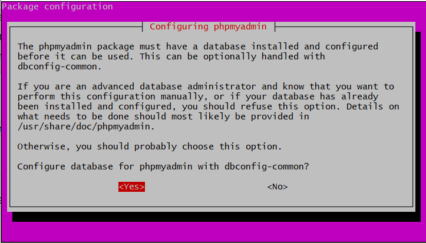

# Servidor remoto

Para poder subir nuestros trabajos a internet, es necesario tener una máquina virtual que haga como servidor remoto de nuestro trabajo.

Para eso, hemos hecho una cuenta en [AWS](https://aws.amazon.com/es/education/awseducate/) (Amazon web services), ya que esta página nos da la posibilidad de crear todas las máquinas virtuales que querammos gratuitamente. Lo malo de esta forma gratuita, es que los servidores no pueden estar encendidos más de 750 horas (el equivalente a 31 días) por eso hay que apagar el servidor cada vez que dejemos de utilizarlo.

Trás este breve resumen, vamos a ver qué hay que hacer para poder ponerlo en funcionamiento:

### Paso 1: Conectarnos mediante nuestro terminal

Primero de todo, es crucial tener descargado el programa [Git](https://git-scm.com/downloads) para poder conectarnos al servidor remoto mediante su terminal, existen otros programas con los que podemos conectar pero no aseguramos que funcionen estos comandos en esos programas.

Vamos a necesitar localizar dónde está nuestra key. Es un archivo que tuvimos que haber descargado cuando creamos el servidor.

Una vez localizada la key, la haremos solo visible para nosotros.

Hecho esto, es hora de conectarnos con el comando ssh.

(Tanto el nombre de la llave como el link de conexión del server los encontrarás en el botón "conect" en el apartado de "instances", para que el botón sea clickable tienes que encender el servidor)

Meteremos ese comando que sale en el ejemplo y ya estariamos dentro del servidor remoto

### Paso 2: instalar apache2 en nuestro servidor

Antes de instalar apache tenemos que actualizar el servidor.

Una vez actualizado lo instalaremos mediante el siguiente comando

Ya con el apache instalado tendremos que ir a AWS y en "description->security groups->launch-wizard-2." meteremos el HTTP y HTTPS para que podamos entrar mediante nuestros navegadores

Finalmente le damos a "add rule" y arriba nos saldrá un nuevo tipo que tendremos que hacerlo HTTP (como sale arriba) y otro para el HTTPS (aunque salgan dos solamente haz)

Si lo hemos hecho perfectamente, al poner en "instances" deberíamos tener el "public DNS". Lo copiamos y pegamos en la barra de URL y nos saldrá esta página:

### Paso 3: Instalar MySQL

Ahora que nuestro servidor funciona perfectamente, vamos a instalaronos el siguiente programa "MySQL". Este programa nos ayudara a manejar las Bases de datos.

Empezaremos instalándolo con la función apt:

Te saldrán paquetes para descargar, si le damos a "Y" se nos descargarán. Después de instalarlo empezaremos con la configuración del mySQL.

Nos preguntará si queremos poner una contraseña para  Debes tener en cuenta que si digitas 2 representando el nivel más fuerte, recibirás errores al intentar utilizar una contraseña que no contenga números, letras mayúsculas y minúsculas, así como caracteres especiales; además la contraseña no podrá estar basada en palabras comunes en un diccionario.

### Paso 4: instalar PHP

Una vez instalada la base de datos, necesitaremos archivos para conectar con esas bases de datos que creamos, para eso instalaremos PHP de este modo:

Todo lo demás, nos ayudará a configurarlo para que se ejecute sobre el servidor apache y que se comunique con la base de datos de mySQL.

Podemos hacer que priorice los archivos PHP sobre los de html ya que cuando un usuario solicite un archivo, apache buscará primero los archivos html, pero no es algo obligatorio. Solo tendríamos que abrir el archivo dir.conf mediante nano y cambiar esta parte:

Mueve el archivo de índice de PHP (subrayado arriba) a la primera posición después de la especificación DirectoryIndex.

Trás esto, reiniciaremos el apache para que se apliquen los cambios

Para terminar la instalación de PHP, puedes descargar diferentes módulos que te podrán servir, Si quieres ver los módulos que puedes instalar utiliza el comando "apt search php - | less"

Usa las flechas para moverte hacia arriba y abajo, y pulsa Q para salir.

Y si quisieras una descripción más detallada del paquete, solamente tendrías que poner "apt show nombre_paquete"

### Paso 4: Instalar phpMyAdmin

Terminaremos descargándonos el phpMyAdmin, para que podamos acceder a la base de datos con solo poner *nuestro_URL/phpMyAdmin*

Lo primero de todo, instalaremos phpMyAdmin en el servidor remoto.

Se nos empezarán a instalar phpMyAdmin

#### ADVERTENCIA:
En la instalación nos saldrá un pantallazo con dos checkbox con el nombre de apache2 justo alado de uno de los checkbox

Tienes que darle al espacio para seleccionar apache2 y posteriormente darle al enter.

Te volverá a saltar otro pantallazo. Este pantallazo te dirá que phpmyadmin necesita una base de datos y por ende, te pregunta si puede crear una o, en el caso de que seas un administrador de bases de datos avanzado quieras crear una base de datos por ti solo. En el caso de que sepas manejar la base de datos y quieras crear una pulsa no.

por último te pedirá que escribas una contraseña para el administrador de la base de datos y otra para la aplicación.

Trás la instalación, en el directorio *etc/apache2/conf-enabled* se añadirá un archivo de configuración de phpMyAdmin Apache.

Habilitamos las extensiones de PHP mediante los siguientes códigos

y por último reiniciamos el servidor apache para que se guarden los cambios

y finalmente accederemos mediante nuestro navegador a la base de datos de nuestro server.

### Fuentes
* [Cómo instalar en Ubuntu 18.04 la pila LAMP — Linux, Apache, MySQL y PHP](https://www.digitalocean.com/community/tutorials/como-instalar-en-ubuntu-18-04-la-pila-lamp-linux-apache-mysql-y-php-es)
* [¿Cómo Instalar y Proteger phpMyAdmin en Ubuntu 16.04?](https://www.digitalocean.com/community/tutorials/como-instalar-y-proteger-phpmyadmin-en-ubuntu-16-04-es)