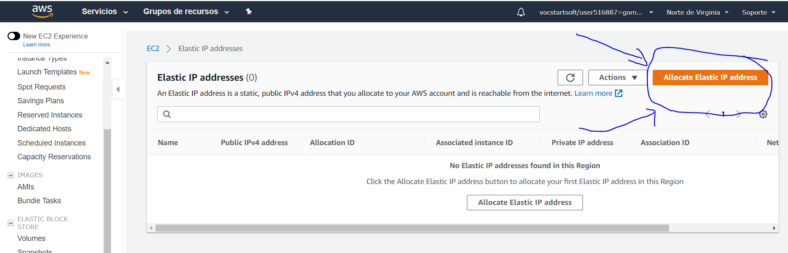
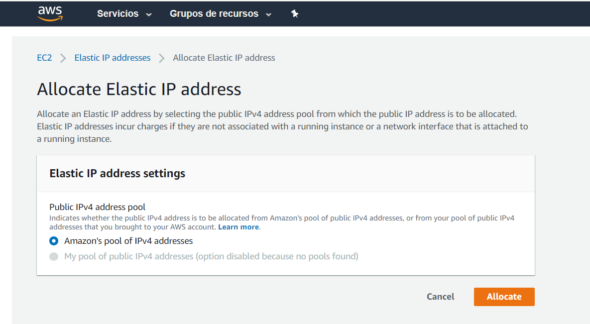
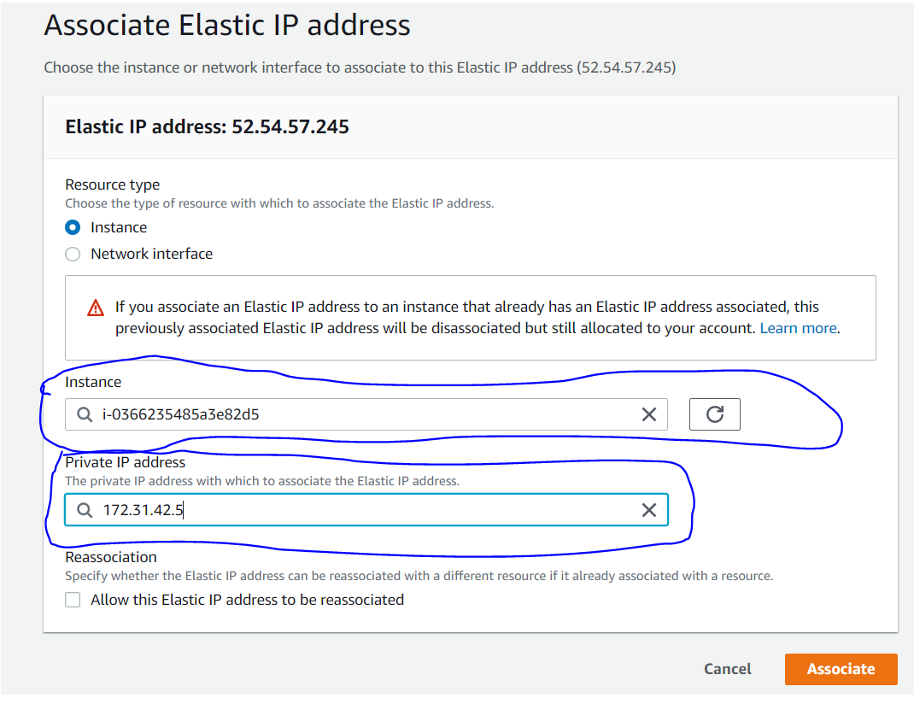

### TAREA 2: Solventar problemas de direccionamiento

Nuestro servidor está preparado para funcionar; sin envargo, cada vez que encendemos el servidor y lo apagamos, cambia nestra IP.

Nuestra IP se cambia porque tenemos una dirección IP pública, para que no se cambie, crearemos una IP elástica y así, cada vez que iniciemos el servidor, no se cambiará nuestra IP.

Si entras en "instances" podrás ver en las características del servidor la IP pública que se irá cambiando según enciendes y apagas el servidor.

En el navegador de alado podrás ver que tenemos una opción llamada "Ip elástica" 

Nos abrirá una nueva página en el que nos dará la posibilidad de alocarla

Le daremos de nuevo a alocar

Finalmente nos quedará algo así

Solo nos quedaría seleccionar el servidor y la IP

