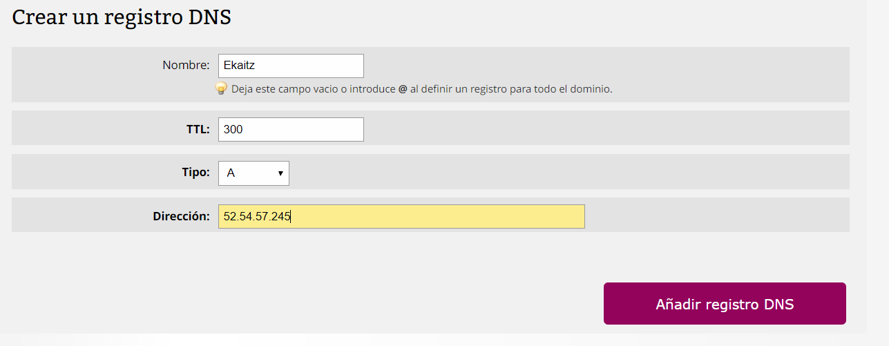

### Gestión DNS

Estando en el panel de nuestro hosting, iremos a "Dominios y DNS" y le daremos en "Registros DNS".

Una vez estemos ahí nos pedirá que metamos el nombre del subdominio que queremos vincular con nuestro servidor. podremos hacerlo de diferentes tipos, pero el que nos interesa es el "tipo A". 

