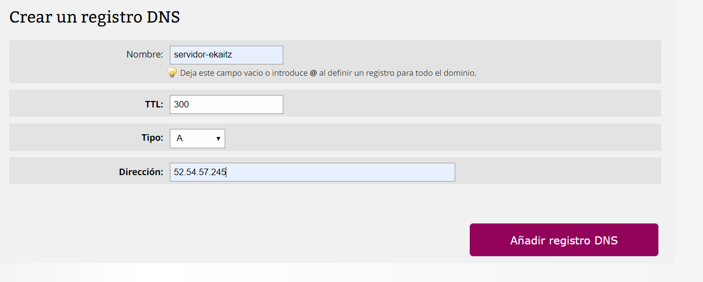
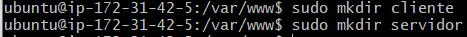
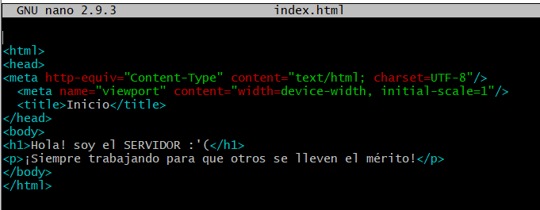
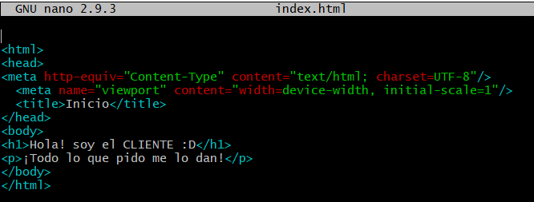
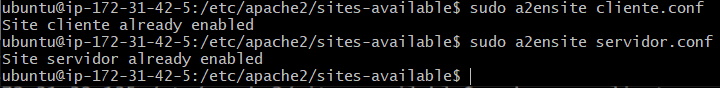
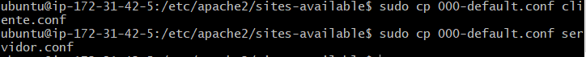
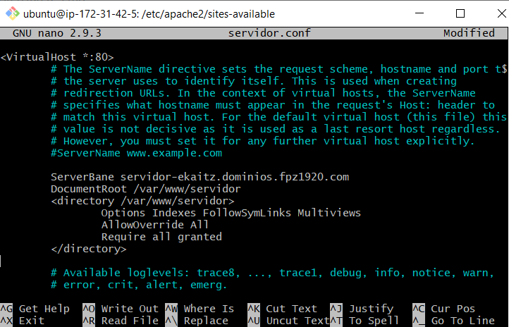
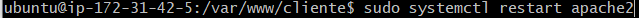
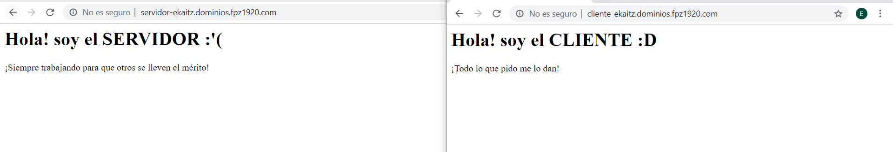

### Virtual Hosts

Crearemos dos subdominios de nuevo, como lo hicimos en la [Tarea 3](https://github.com/ekaitz888/evidencias/blob/master/tarea%203/evidencias/DNS.md)

Uno de cliente y otro para servidor

En el servidor, crearemos en el directorio *var/www* las carpetas *servidor* y *cliente*

Vamos a crear dos archivos html en las carpetas llamadas *index.html*

Uno para servidor y otro para cliente

Usaremos el comando a2ensite para habilitarlos

Copiaremos el archivos *000-default.conf* que tenemos en sites-avaliable a los archivos *.conf* de cada archivo index que hemos hecho anteriormente

Los archivos conf vamos a editarlos para crear un directorio al *var/www* para que se nos abra el archivo en el navegador

 

Finalmente vamos a reiniciar el systemctl para que se apliquen los cambios al apache

Si entramos a la página desde nuestro navegador nos saldrá el archivo subido al servidor

